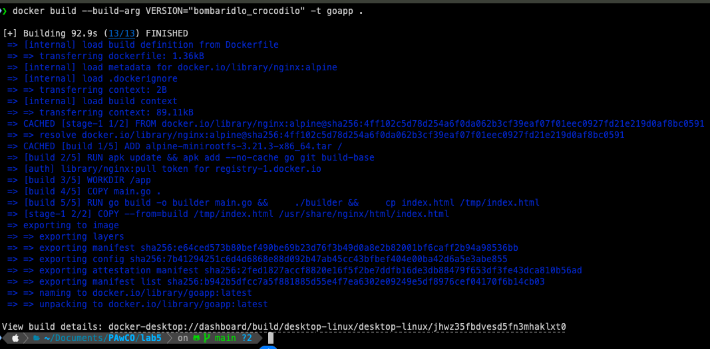
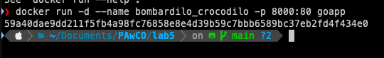
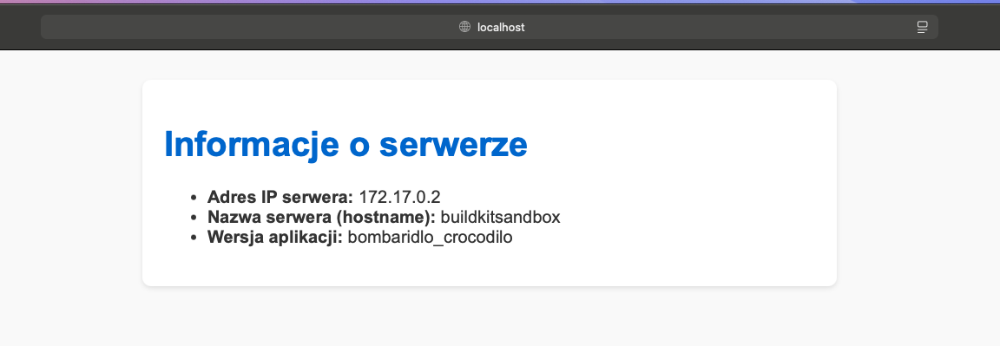
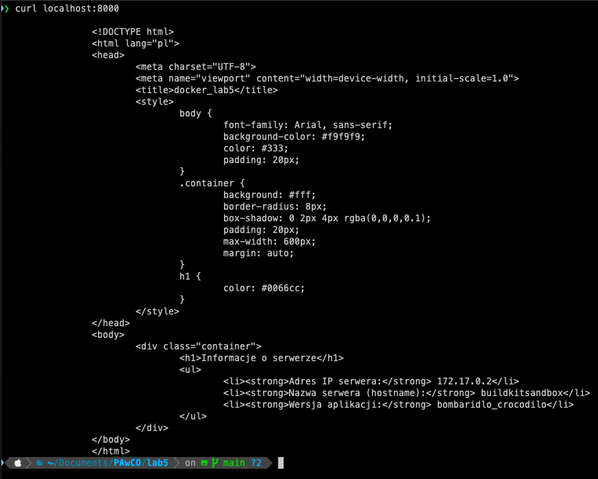

# main.go

```go 
package main

import (
    "fmt"
    "io/ioutil"
    "net"
    "os"
)

func main() {
    version := os.Getenv("VERSION")
    if version == "" {
        version = "dev"
    }

    hostname, _ := os.Hostname()

    addrs, _ := net.InterfaceAddrs()
    var ip string
    for _, addr := range addrs {
        if ipnet, ok := addr.(*net.IPNet); ok && !ipnet.IP.IsLoopback() && ipnet.IP.To4() != nil {
            ip = ipnet.IP.String()
            break
        }
    }

    htmlContent := fmt.Sprintf(`
		<!DOCTYPE html>
		<html lang="pl">
		<head>
			<meta charset="UTF-8">
			<meta name="viewport" content="width=device-width, initial-scale=1.0">
			<title>docker_lab5</title>
			<style>
				body {
					font-family: Arial, sans-serif;
					background-color: #f9f9f9;
					color: #333;
					padding: 20px;
				}
				.container {
					background: #fff;
					border-radius: 8px;
					box-shadow: 0 2px 4px rgba(0,0,0,0.1);
					padding: 20px;
					max-width: 600px;
					margin: auto;
				}
				h1 {
					color: #0066cc;
				}
			</style>
		</head>
		<body>
			<div class="container">
				<h1>Informacje o serwerze</h1>
				<ul>
					<li><strong>Adres IP serwera:</strong> %s</li>
					<li><strong>Nazwa serwera (hostname):</strong> %s</li>
					<li><strong>Wersja aplikacji:</strong> %s</li>
				</ul>
			</div>
		</body>
		</html>
`, ip, hostname, version)

    err := ioutil.WriteFile("index.html", []byte(htmlContent), 0644)
    if err != nil {
        fmt.Printf("Błąd zapisu pliku index.html: %v\n", err)
        os.Exit(1)
    }
    fmt.Println("Plik index.html został wygenerowany.")
}

```

# Dockerfile

```dockerfile
# etap budowania aplikacji
FROM scratch AS build

# dodanie systemu bazowego (Alpine)
ADD alpine-minirootfs-3.21.3-x86_64.tar /

# zmienna wersji aplikacji
ARG VERSION="bombardilo_crocodilo_1.2"

# ustawienie powłoki
SHELL ["/bin/sh", "-c"]

# instalacja zależności do budowy aplikacji
RUN apk update && apk add --no-cache go git build-base

# ustawienie katalogu roboczego
WORKDIR /app

# skopiowanie pliku źródłowego
COPY main.go .

# ustawienie zmiennej środowiskowej
ENV VERSION=${VERSION}

# kompilacja i generowanie pliku HTML
RUN go build -o builder main.go && \
    ./builder && \
    cp index.html /tmp/index.html

# etap końcowy z serwerem nginx
FROM nginx:alpine

# skopiowanie statycznego pliku HTML do katalogu serwowanego przez nginx
COPY --from=build /tmp/index.html /usr/share/nginx/html/index.html

# dodanie healthchecka
HEALTHCHECK --interval=30s --timeout=3s --retries=3 \
  CMD wget -q -O- http://localhost:80 || exit 1

# uruchomienie nginx w trybie pierwszoplanowym
CMD ["nginx", "-g", "daemon off;"]


# Polecenie do budowania obrazu
```bash 
docker build --build-arg VERSION="bombardilo_crocodilo" -t goapp .
```


# Screenshot z budowania obrazu



# Polecenie do uruchomienia kontenera

```bash
docker run -d --name bombardilo_crocodilo -p 8000:80 goapp
    - -d - uruchomienie kontenera w tle
```

# Screenshot z polecenia docker run



# Screenshot z poprawnego uruchomienia kontenera w przegladarce



# Sprawdzenie poprawnego działania konteneraza pomoca polecenia curl



